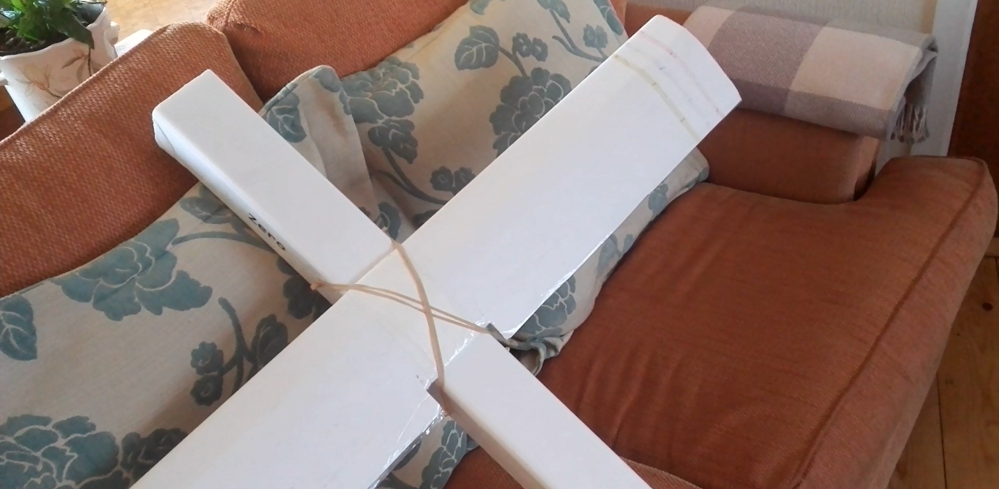
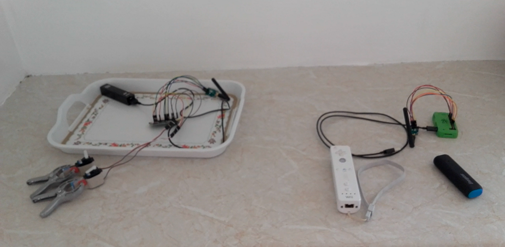

# RPI Glider

*Image 1. A small glider with the stack installed, ready to be flown*

## A technology stack that allows a user to control a Glider for a fraction of the cost

### Hardware needed - RPI Zero x 2, LORA modeule x 2, Servo x 2, Wii remote or other game cotroller

*Image 2. Here we see 2 RPI's, two servos, a Wii remote for controling the plane, two lora modules for radio communication*

## Details

### Notes 

u 117
d 100
l 108
r 114
a 97
b 98
o 111

>>

echo "# RPI-Glider" >> README.md
git init
git add README.md
git commit -m "first commit"
git remote add origin https://github.com/andrewdempsey2018/RPI-Glider.git
git push -u origin master